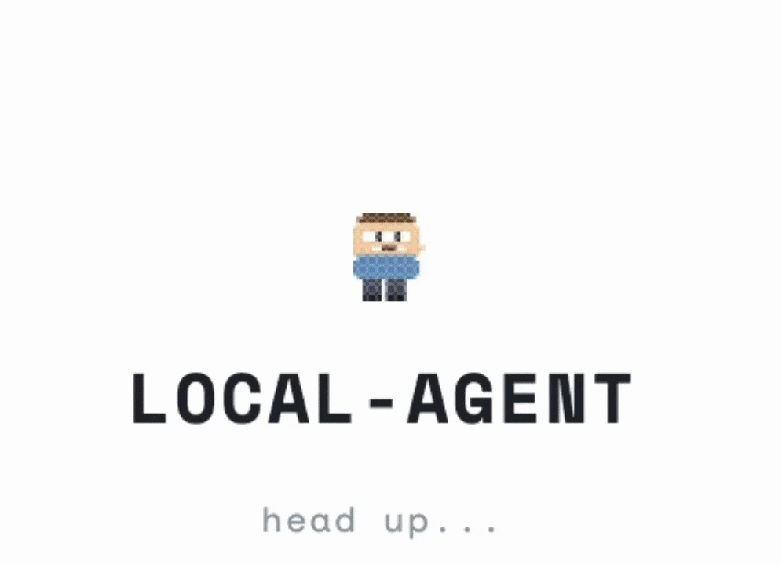
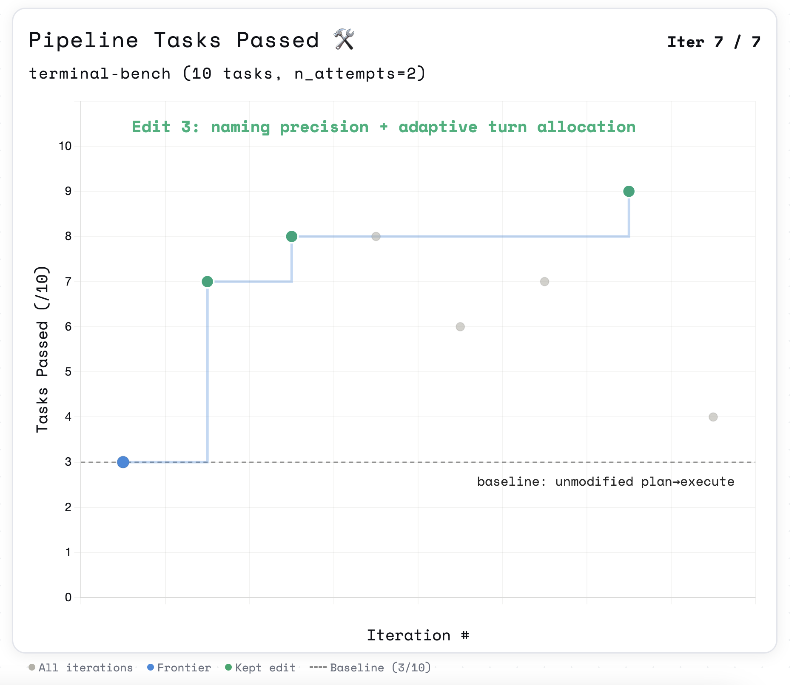

# AutoSwarm

[](https://opensource.org/licenses/MIT)
[](https://github.com/arteemg/autoswarm)
[](https://github.com/arteemg/autoswarm)
[](https://www.python.org/)
[](https://docker.com)

<p align="center">
  <br>
  <a href="https://discord.gg/9ggSRAFGKQ">
    
  </a>
   <br>
  
</p>


AutoSwarm is a benchmark harness over [Harbor](https://github.com/laude-institute/harbor) tasks. A meta-agent edits stage prompts, tools, turn budgets, and pipeline structure to hill-climb on `passed` tasks.

## Install

```bash
pip install -e .            # editable install from the repo
```

Requires Python 3.12+.


## Running the meta-agent

Point your coding agent at the repo and prompt:

```
Read benchmark/program_pipeline.md and let's kick off a new experiment!
```

The meta-agent will read the directive, inspect `benchmark/pipeline_spec.yaml`, run the benchmark, score each stage with `benchmark/evaluator.py`, edit the topology, and iterate.



## Prompt optimization with GEPA

Stage prompts are tuned automatically with [GEPA](https://github.com/gepa-ai/gepa) (reflective prompt evolution): the meta-agent owns topology and tools, GEPA owns the prompt text. Candidates are scored by real Harbor rollouts; the reflection LM sees verifier output plus per-stage judge feedback from `benchmark/evaluator.py`.

```bash
uv run python -m benchmark.gepa_run --max-metric-calls 100 --write-back
```

One metric call = one task rollout, so budget accordingly. Outputs (rollouts, `best_candidate.json`, an optimized spec, resumable GEPA state) go to `jobs/gepa/<timestamp>/`. See `benchmark/gepa_adapter.py` for the Harbor↔GEPA bridge.

## Task format

Tasks follow [Harbor's format](https://harborframework.com/docs/tasks):

```text
tasks/my-task/
  task.toml           -- config (timeouts, metadata)
  instruction.md      -- prompt sent to the agent
  tests/
    test.sh           -- entry point, writes /logs/reward.txt
    test_outputs.py   -- verification (deterministic or LLM-as-judge)
  environment/
    Dockerfile        -- task container image for Harbor
```

## License

MIT
